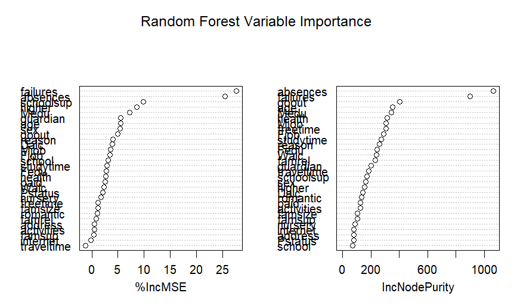
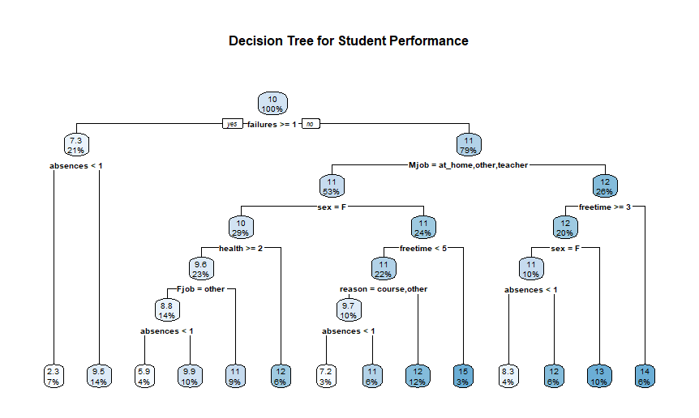
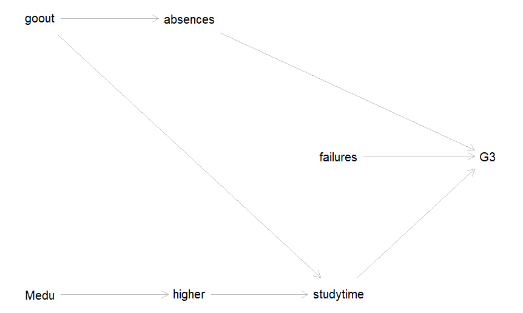

# Machine Learning-Informed Theory Construction: An Inductive-to-Deductive Workflow

This repository contains a functional implementation of an **inductive-to-deductive scientific pipeline** written in R. It demonstrates how regularized machine learning can be leveraged as an inductive engine to isolate structural predictive anchors, formalize them into a causal Directed Acyclic Graph (DAG), and deductively validate them using confirmatory linear models.

The workflow is evaluated using the UCI Student Performance dataset.

---
---

## 📊 Dataset Profile: Student Performance

The pipeline utilizes the **Student Performance Dataset** from the UCI Machine Learning Repository. The data was collected during the 2005–2006 academic year from two Portuguese secondary schools: Gabriel Pereira (GP) and原始 Mariano Serra (MS). 

It captures student demographic, social, and school-bound attributes specifically for the **Mathematics** cohort ($N = 395$ students).

### 📐 Structural Attributes
* **Instance Count:** 395 profiles
* **Dimensionality:** 33 attributes (including demographic, family background, academic history, and lifestyle factors)
* **Target Metric ($G3$):** Final grade, recorded on a 0–20 integer scale.

### 🔑 Key Explanatory Variables Evaluated

| Variable | Type | Description | Values / Scale |
| :--- | :--- | :--- | :--- |
| **`failures`** | Numeric | Past class failures | $n$ if $1 \le n < 3$, else $4$ if $n > 3$ |
| **`absences`** | Numeric | Number of school absences | Count scale ($0$ to $75$) |
| **`Medu`** | Numeric | Mother's education level | $0$: None; $1$: Primary; $2$: 5th–9th grade; $3$: Secondary; $4$: Higher |
| **`goout`** | Numeric | Out-of-school socialization with friends | Likert scale ($1$: Very Low to $5$: Very High) |
| **`studytime`** | Numeric | Weekly study time allocation | $1$: $<2$ hrs; $2$: $2\text{--}5$ hrs; $3$: $5\text{--}10$ hrs; $4$: $>10$ hrs |
| **`higher`** | Categorical | Structural interest in pursuing higher education | Binary (`yes` or `no`) |

### 📑 Academic Citation

If you use this dataset or workflow in an academic framework, please cite the primary source:

> Cortez, P., & Silva, A. M. G. (2008). *Using Data Mining to Predict Secondary School Student Performance.* In H. Brito & J. Teixeira (Eds.), Proceedings of 5th FUture BUsiness TEChnology Conference (FUBUTEC 2008) (pp. 5-12). Porto, Portugal: EUROSIS-ETI.

---
## 🛠️ Pipeline Architecture

1. **Inductive Feature Screening:** A Random Forest regressor filters through 30+ multi-dimensional behavioral and demographic variables to determine key non-linear anchors for final student grades ($G3$).
   
   

2. **Structural Formalization:** Variables displaying significant incremental Mean Squared Error ($\%\Delta\text{MSE}$) are extracted and mapped into a formal causal network graph using `dagitty`.
   
   
   
   

3. **Deductive Confirmatory Testing:** The structurally implied paths of the customized theory are formally evaluated using an Ordinary Least Squares (OLS) linear regression model.

---

## 📊 Results and Empirical Findings

The empirical execution of this pipeline yielded a stark contrast between algorithmic pattern discovery and restrictive linear modeling.

### 1. Phase 1: Inductive Machine Learning Screening
A Random Forest regressor ($500$ trees, $m_{try} = 10$) was trained on the dataset excluding intermediate grades ($G1$ and $G2$) to prevent predictive dominance.

* **Model Fit:** The Random Forest established a robust predictive baseline, explaining **$29.56\%$** of the variance in final student grades ($\text{Mean of Squared Residuals} = 14.75$).
* **Feature Importance:** Out of 31 predictors, past academic failures and student absences served as the primary global anchors for predictive accuracy.

| Feature Rank | Variable | Importance ($\%\Delta\text{MSE}$) | Structural Meaning |
| :--- | :--- | :--- | :--- |
| **1** | `failures` | $27.72\%$ | Number of past class failures |
| **2** | `absences` | $25.55\%$ | Number of school absences |
| **3** | `schoolsup` | $9.82\%$ | Extra educational support |
| **4** | `higher` | $8.61\%$ | Desire to pursue higher education |
| **5** | `Medu` | $7.22\%$ | Mother's education level |
| **6** | `goout` | $4.91\%$ | Time spent going out with friends |

### 2. Phase 2: Deductive Theory Validation (OLS Regression)
The top predictive anchors surfaced by the machine learning algorithm were structured into a causal DAG and formally evaluated using an OLS linear regression model. 

The linear model was highly significant overall ($F(6, 388) = 12.82$, $p < 0.001$), but it captured significantly less variance than the machine learning model, reaching a **$\text{Multiple } R^2 = 16.54\%$** ($\text{Adjusted } R^2 = 15.25\%$).

| Independent Variable | Coefficient ($\beta$) | Standard Error | $t$-value | $p$-value | Significance |
| :--- | :---: | :---: | :---: | :---: | :---: |
| **(Intercept)** | $9.05560$ | $1.32858$ | $6.816$ | $< 0.001$ | $***$ |
| **`failures`** | $-1.81592$ | $0.31120$ | $-5.835$ | $< 0.001$ | $***$ |
| **`Medu`** | $0.57132$ | $0.20340$ | $2.809$ | $0.00522$ | $**$ |
| **`goout`** | $-0.42361$ | $0.19353$ | $-2.189$ | $0.02920$ | $*$ |
| **`higheryes`** | $1.36828$ | $1.03012$ | $1.328$ | $0.18487$ | Not Significant |
| **`absences`** | $0.02806$ | $0.02687$ | $1.044$ | $0.29710$ | Not Significant |
| **`studytime`** | $0.12453$ | $0.25990$ | $0.479$ | $0.63212$ | Not Significant |

> $\text{Significance codes: } 0 \text{ '***'} \, 0.001 \text{ '**'} \, 0.01 \text{ '*'} \, 0.05 \text{ '.'}$

---

## 🔬 Methodological Discovery: The "Absences Paradox"

The core takeaway of this pipeline highlights the structural limitations of traditional, purely linear social science workflows:

* **The Variance Capture Gap:** The $13\%$ drop in explained variance from the Random Forest ($29.56\%$) to the linear regression ($16.54\%$) confirms that the structural constraints of additivity and linearity omit massive amounts of systemic signal in behavioral data.
* **The Paradox:** In the Inductive Stage, `absences` was identified as the **second most critical predictor** globally ($\%\Delta\text{MSE} = 25.55\%$). However, in the Deductive Stage, its linear coefficient dropped to near zero ($\beta = 0.028$) and completely lost statistical significance ($p = 0.297$).
* **Methodological Conclusion:** The raw correlation matrix confirms a negligible linear relationship ($r = 0.034$). Because tree-based machine learning captures localized threshold partitions, this indicates that `absences` impacts student performance non-linearly (e.g., performance remains unaffected up to a certain threshold of missed days, after which it drops drastically). Forcing this behavior into a linear equation flattens the effect, validating the core thesis that data-driven inductive methods are essential for building structurally accurate formal theories.

---

## 🚀 Environment and Dependencies
* **Language:** R v4.6.0
* **Core Libraries:** `tidyverse` (v2.0.0), `randomForest` (v4.7-1.2), `dagitty` (v0.3-4), `rpart`, `rpart.plot`.
